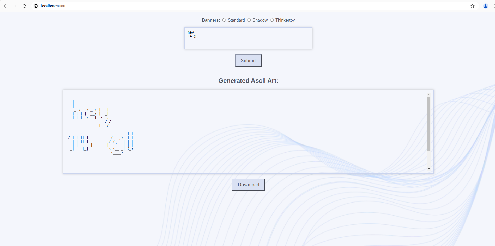

# ASCII-ART-WEB
Ascii-art-web turns text into ASCII art with the following banners:
- Shadow
- Standard
- Thinkertoy

By implementing the two HTTP methods:
1. `GET`: loads the HTML file, parses it and returns it with dynamic data.
2. `POST`: retrieves the data from the form to generate the `ascii-art` and displays it on the web page.

## Usage
### Pré-requis
- Go must be installed on your machine.
### Installation
To use the program, follow these steps:  
- Clone the repository:
```console
git clone <repository-URL>
cd <repository-name>
```
- Open your terminal and run the following command to launch the server:
```console
go run .
``` 
- Open your web browser and navigate to: 
```console
http://localhost:8080
``` 
The default port is 8080, but you can choose your port number:
```console
go run . -port <port number>
```
Then you need to navigate to:
```console
http://localhost:<port number>
``` 
Web user interface with:
- Text entry field
- Radio buttons for banner selection
- Button to send a POST request to /ascii-art and display the result

*Image of the page web*


## Implementation details
### Algorithm
The algorithm transforms text into ASCII art using different banners. This algorithm follows several key steps:
1. <b>Loading banner templates:</b> each banner (Standard, Shadow, Thinkertoy) has a specific template which defines how each character should be represented in ASCII whose templates are stored in files via POST method.
2. <b>Reading input text:</b> the text to be converted into ASCII art is extracted from the data submitted via the web form using the POST method.
3. <b>Character conversion:</b> For each character in the input text, the algorithm searches for its ASCII representation in the selected banner template and this representation is added line by line to a new character string that will constitute the final ASCII art.
4. <b>Ascii final art:</b> the generated lines are combined to form the final Ascii art which is then sent to the HTML template for display on the web page.

## About ASCII standard
ASCII is a character encoding standar
d used for representing text in computers and communication equipment. ASCII defines a set of 128
characters, including uppercase and lowercase letters, digits, punctuation marks, control characters (such as newline and tab), and
non-printable characters. Each character in ASCII is represented by a 7-bit binary number (0-127), which allows for 128 unique characters.
The ASCII standard was first published in 1963 and has since become widely adopted as the de facto standard for character encoding in
computing systems. ASCII characters are used to represent text in various applications, including text files, programming languages,
communication protocols, and user interfaces. While ASCII is limited to representing characters from the English alphabet and some common
symbols, it remains a fundamental encoding standard in computer systems.<br><br>


## About HTTP response code status
- **200 OK**: Standard response for successful HTTP requests.
- **400 Bad Request**: The server cannot or will not process the request due to an apparent client error (e.g., malformed request syntax...).
- **404 Not Found**: The requested resource could not be found but may be available in the future.
- **500 Internal Server Error**: The server encountered an error and could not complete the request.<br/>
For more details [HTTP status codes](https://en.wikipedia.org/wiki/List_of_HTTP_status_codes)

## License
This project is open-sourced under [the MIT License](https://opensource.org/license/mit).
